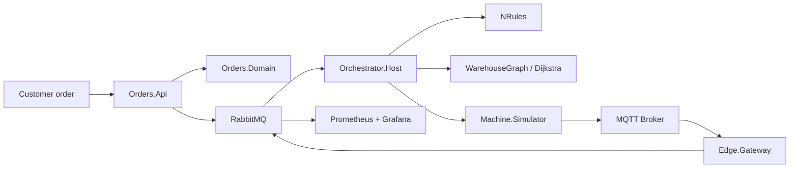
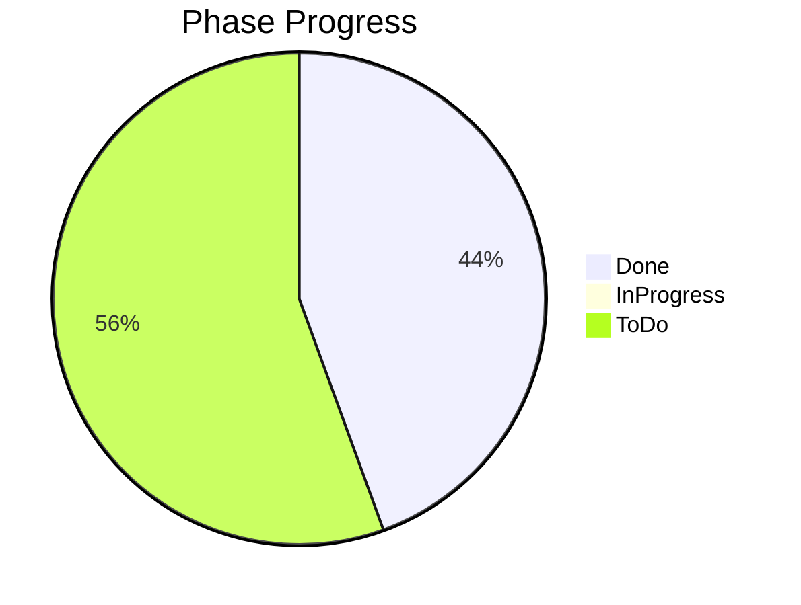
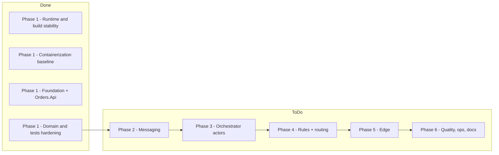

# Smart Intralogistics Orchestrator

.NET 10 intralogistics orchestration platform that delivers the full warehouse automation workflow end to end, with APIs, SQL persistence, reporting, integration tests, messaging, actor-based orchestration, routing, and edge integration.
It covers the complete flow from orders → pallets → machines → routing → dispatch and is built as a concrete, working event-driven industrial system.

## Architecture at a glance



## Main services

- Orders.Api: order intake and health endpoints.
- Orchestrator.Host: actor system host and orchestration loop.
- Machine.Simulator: produces telemetry and machine states.
- Edge.Gateway: MQTT normalization and store-and-forward.

## Running the project

1. Install .NET 10 SDK.
2. Start infrastructure:
   `docker compose up --build`
3. Start the API:
   `dotnet run --project src/Orders.Api/Orders.Api.csproj`
4. Optionally start orchestrator and edge workers:
   `dotnet run --project src/Orchestrator.Host/Orchestrator.Host.csproj`
   `dotnet run --project src/Edge.Gateway/Edge.Gateway.csproj`

## Testing

```bash
dotnet test
```

## Project structure

- src/BuildingBlocks
- src/Orders.Domain
- src/Orders.Application
- src/Orders.Infrastructure
- src/Orders.Api
- src/Contracts
- src/Orchestrator.Domain
- src/Orchestrator.Application
- src/Orchestrator.Host
- src/Machine.Simulator
- src/Edge.Gateway
- tests/
- docs/
- deploy/

## Limitations

This repository is a working scaffold and implementation baseline based on the provided specification. Some advanced enterprise integrations and full end-to-end runtime deployment are represented as architecture-first skeletons rather than a full production system.

## ADRs

See the ADRs in [docs/adr](docs/adr).

## Phase progress recap

### Snapshot





### Done

| Phase | Scope | Evidence |
| --- | --- | --- |
| Phase 1 - Runtime and build stability | .NET 10 migration and build reliability | `net10.0` applied, `dotnet restore` and `dotnet build -warnaserror` pass |
| Phase 1 - Containerization baseline | Local runnable container setup | `Orders.Api` Dockerfile and compose service present |
| Phase 1 - Foundation + Orders.Api | Scaffold, baseline architecture, API entry points | Endpoints implemented, EF migration generated, SQL report stored procedure bootstrap added |
| Phase 1 - Domain and tests hardening | Pallet lifecycle and architecture guardrails | Unit, architecture, and SQL integration tests pass (`dotnet test`) |

### Next (ToDo)

| Phase | Focus now | Next concrete step |
| --- | --- | --- |
| Phase 2 - Messaging | RabbitMQ + MassTransit + outbox/inbox | Implement publish/consume with idempotency and retries |
| Phase 3 - Orchestrator actors | Akka.NET hierarchy, supervision, backpressure | Implement actors and supervision/fault-path tests |
| Phase 4 - Rules + routing | NRules + dynamic rerouting | Add rules, property-based routing tests, rerouting scenario |
| Phase 5 - Edge | Simulator + MQTT + store-and-forward | Implement buffering, deduplication, outage recovery tests |
| Phase 6 - Quality, ops, docs | Observability, CI/CD, runbook completeness | Add dashboards, CI hardening, final runbook and recap |
