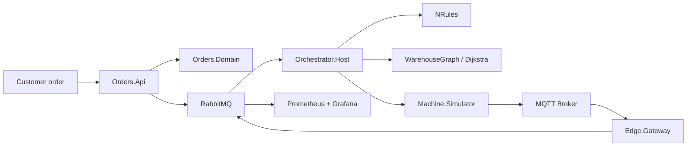

# Smart Intralogistics Orchestrator

This repository implements the project skeleton for a modern intralogistics orchestration platform described in the specification. It follows a clean architecture, CQRS-oriented API, event-driven messaging model, and actor-based orchestrator pattern for pallet flows, routing, and fault handling.

## Architecture at a glance



## Main services

- Orders.Api: order intake and health endpoints.
- Orchestrator.Host: actor system host and orchestration loop.
- Machine.Simulator: produces telemetry and machine states.
- Edge.Gateway: MQTT normalization and store-and-forward.

## Running the project

1. Install .NET 10 SDK.
2. Start infrastructure:
   `docker compose up --build`
3. Start the API:
   `dotnet run --project src/Orders.Api/Orders.Api.csproj`
4. Optionally start orchestrator and edge workers:
   `dotnet run --project src/Orchestrator.Host/Orchestrator.Host.csproj`
   `dotnet run --project src/Edge.Gateway/Edge.Gateway.csproj`

## Testing

```bash
dotnet test
```

## Project structure

- src/BuildingBlocks
- src/Orders.Domain
- src/Orders.Application
- src/Orders.Infrastructure
- src/Orders.Api
- src/Contracts
- src/Orchestrator.Domain
- src/Orchestrator.Application
- src/Orchestrator.Host
- src/Machine.Simulator
- src/Edge.Gateway
- tests/
- docs/
- deploy/

## Limitations

This repository is a working scaffold and implementation baseline based on the provided specification. Some advanced enterprise integrations and full end-to-end runtime deployment are represented as architecture-first skeletons rather than a full production system.

## ADRs

See the ADRs in [docs/adr](docs/adr).

## Phase progress recap

Status legend: Done | InProgress | ToDo

| Status | Phase | Scope | Current evidence | Next step |
| --- | --- | --- | --- | --- |
| Done | Phase 1 - Runtime and build stability | .NET 10 migration and build reliability | `net10.0` applied, `dotnet restore` and `dotnet build -warnaserror` pass | Keep dependency updates under control |
| Done | Phase 1 - Containerization baseline | Local runnable container setup | `Orders.Api` Dockerfile and compose service are present | Validate full compose flow from a clean environment |
| Done | Phase 1 - Foundation + Orders.Api | Scaffold, baseline architecture, API entry points | Orders API endpoints implemented, EF migration generated, SQL report procedure bootstrap added | Extend behavior in Phase 2 with messaging/outbox integration |
| Done | Phase 1 - Domain and tests hardening | Pallet lifecycle and architecture guardrails | Transition matrix coverage added; architecture, unit, and SQL integration tests pass (`dotnet test` green) | Keep growing domain coverage with Phase 3 actor behavior tests |
| ToDo | Phase 2 - Messaging | RabbitMQ + MassTransit + outbox/inbox | Contracts project exists, messaging flow not implemented yet | Implement publisher/consumer flow with idempotency and retries |
| ToDo | Phase 3 - Orchestrator actors | Akka.NET hierarchy, supervision, backpressure | Host skeleton exists | Implement actors and actor-level supervision/fault tests |
| ToDo | Phase 4 - Rules + routing | NRules policies and dynamic rerouting | Routing domain baseline exists | Add rules, property-based routing tests, rerouting scenario |
| ToDo | Phase 5 - Edge | Simulator + MQTT + store-and-forward | Simulator and gateway skeletons exist | Implement telemetry buffering, deduplication, outage recovery |
| ToDo | Phase 6 - Quality, ops, docs | Observability, CI/CD, runbook completeness | Initial docs and ADR set present | Add dashboards, CI hardening, final runbook and recap |
