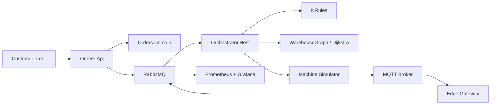
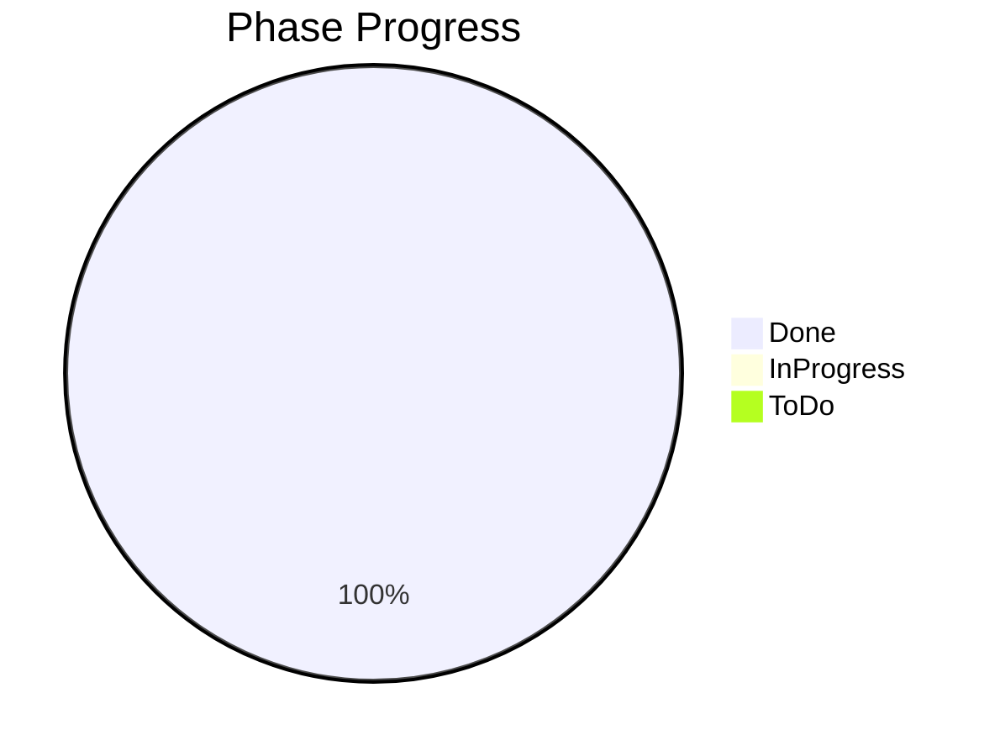
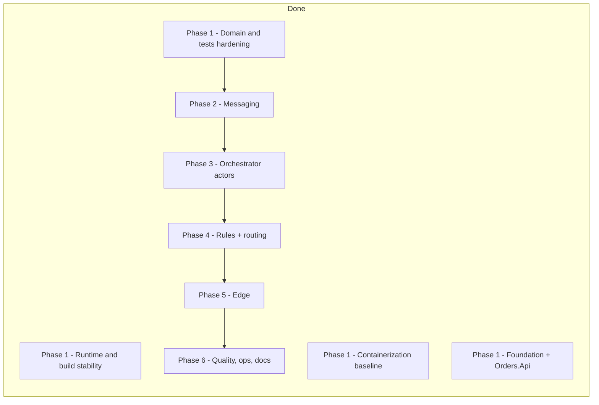

# Smart Intralogistics Orchestrator

.NET 10 intralogistics orchestration platform that delivers the full warehouse automation workflow end to end, with APIs, SQL persistence, reporting, integration tests, messaging, actor-based orchestration, routing, and edge integration.
It covers the complete flow from orders → pallets → machines → routing → dispatch and is built as a concrete, working event-driven industrial system.

## Architecture at a glance



## Main services

- Orders.Api: order intake and health endpoints.
- Orchestrator.Host: actor system host and orchestration loop.
- Machine.Simulator: produces telemetry and machine states.
- Edge.Gateway: MQTT normalization and store-and-forward.

## Running the project

1. Install .NET 10 SDK.
2. Start infrastructure:
   `docker compose up --build`
3. Start the API:
   `dotnet run --project src/Orders.Api/Orders.Api.csproj`
4. Optionally start orchestrator and edge workers:
   `dotnet run --project src/Orchestrator.Host/Orchestrator.Host.csproj`
   `dotnet run --project src/Edge.Gateway/Edge.Gateway.csproj`
5. Start the simulator:
   `dotnet run --project src/Machine.Simulator/Machine.Simulator.csproj`

## Testing

```bash
dotnet test
```

Metrics endpoint for Prometheus scraping: `/metrics`

## Edge outage recovery demo

1. Start the stack and run the gateway plus simulator.
2. Stop RabbitMQ temporarily:
   `docker compose stop rabbitmq`
3. Let the simulator continue publishing telemetry for at least 10 seconds.
4. Restart RabbitMQ:
   `docker compose start rabbitmq`
5. Observe the gateway logs: buffered telemetry is flushed in order after reconnection, without duplicate `(MachineId, Sequence)` deliveries.

## Project structure

- src/BuildingBlocks
- src/Orders.Domain
- src/Orders.Application
- src/Orders.Infrastructure
- src/Orders.Api
- src/Contracts
- src/Orchestrator.Domain
- src/Orchestrator.Application
- src/Orchestrator.Host
- src/Machine.Simulator
- src/Edge.Gateway
- tests/
- docs/
- deploy/

## Limitations

This repository delivers a complete local reference implementation of the specified intralogistics platform, including API, orchestration, routing, messaging, edge buffering, monitoring, and automated test coverage. Stretch goals such as alternative telemetry backends or additional UI surfaces remain optional extensions rather than core gaps.

## ADRs

See the ADRs in [docs/adr](docs/adr).

## Phase progress recap

### Snapshot





### Done

| Phase | Scope | Evidence |
| --- | --- | --- |
| Phase 1 - Runtime and build stability | .NET 10 migration and build reliability | `net10.0` applied, `dotnet restore` and `dotnet build -warnaserror` pass |
| Phase 1 - Containerization baseline | Local runnable container setup | `Orders.Api` Dockerfile and compose service present |
| Phase 1 - Foundation + Orders.Api | Scaffold, baseline architecture, API entry points | Endpoints implemented, EF migration generated, SQL report stored procedure bootstrap added |
| Phase 1 - Domain and tests hardening | Pallet lifecycle and architecture guardrails | Unit, architecture, and SQL integration tests pass (`dotnet test`) |
| Phase 2 - Messaging | RabbitMQ + MassTransit + outbox/inbox | Order creation persists an outbox event, the dispatcher publishes it, and the orchestrator consumer deduplicates deliveries |
| Phase 3 - Orchestrator actors | Akka.NET hierarchy, supervision, backpressure | Supervised machine queue actor enforces backpressure and restarts cleanly after fault injection |
| Phase 4 - Rules + routing | NRules + dynamic rerouting | NRules-backed route planning computes the shortest path and reroutes around blocked nodes with unit coverage |
| Phase 5 - Edge | Simulator + MQTT + store-and-forward | Simulator telemetry is buffered in SQLite during broker outage, deduplicated by `(MachineId, Sequence)`, and flushed after recovery |
| Phase 6 - Quality, ops, docs | Observability, CI/CD, runbook completeness | Prometheus metrics, Grafana dashboard provisioning, CI workflow, final runbook, and consolidated recap are in place |

### Final status

All planned phases in the current roadmap are complete. The repository is ready for local end-to-end demos, CI validation, and further optional extensions.
