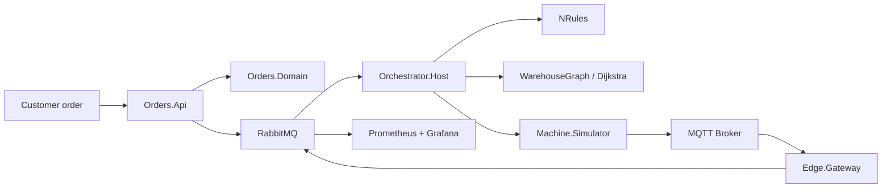

# Smart Intralogistics Orchestrator

This repository implements the project skeleton for a modern intralogistics orchestration platform described in the specification. It follows a clean architecture, CQRS-oriented API, event-driven messaging model, and actor-based orchestrator pattern for pallet flows, routing, and fault handling.

## Architecture at a glance



## Main services

- Orders.Api: order intake and health endpoints.
- Orchestrator.Host: actor system host and orchestration loop.
- Machine.Simulator: produces telemetry and machine states.
- Edge.Gateway: MQTT normalization and store-and-forward.

## Running the project

1. Install .NET 10 SDK.
2. Start infrastructure:
   `docker compose up --build`
3. Start the API:
   `dotnet run --project src/Orders.Api/Orders.Api.csproj`
4. Optionally start orchestrator and edge workers:
   `dotnet run --project src/Orchestrator.Host/Orchestrator.Host.csproj`
   `dotnet run --project src/Edge.Gateway/Edge.Gateway.csproj`

## Testing

```bash
dotnet test
```

## Project structure

- src/BuildingBlocks
- src/Orders.Domain
- src/Orders.Application
- src/Orders.Infrastructure
- src/Orders.Api
- src/Contracts
- src/Orchestrator.Domain
- src/Orchestrator.Application
- src/Orchestrator.Host
- src/Machine.Simulator
- src/Edge.Gateway
- tests/
- docs/
- deploy/

## Limitations

This repository is a working scaffold and implementation baseline based on the provided specification. Some advanced enterprise integrations and full end-to-end runtime deployment are represented as architecture-first skeletons rather than a full production system.

## ADRs

See the ADRs in [docs/adr](docs/adr).

## Phase progress recap

| Phase / Development | Scope | Status |
| --- | --- | --- |
| Phase 1 - Foundation + Orders.Api | Solution scaffold, domain foundations, API baseline | InProgress |
| Phase 1 - Orders API persistence | EF Core DbContext wiring, SQL connection configuration, endpoint persistence | InProgress |
| Phase 1 - Pallet lifecycle tests | Valid and invalid transition coverage extension | InProgress |
| Phase 1 - Containerization baseline | Orders.Api Dockerfile and compose service integration | Done |
| Phase 2 - Messaging | RabbitMQ + MassTransit, outbox/inbox, idempotent consumers | ToDo |
| Phase 3 - Orchestrator actors | Akka.NET actor hierarchy, supervision, queue backpressure | ToDo |
| Phase 4 - Rules + routing | NRules policies, Dijkstra property tests, rerouting | ToDo |
| Phase 5 - Edge | MQTT simulator and store-and-forward gateway | ToDo |
| Phase 6 - Quality, ops, docs | Observability, CI/CD hardening, runbook completeness | ToDo |
